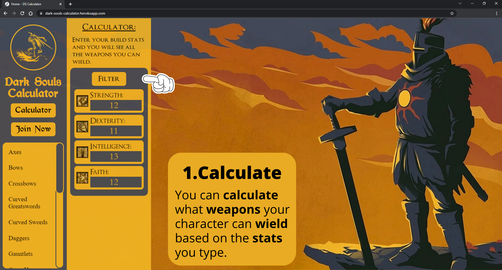
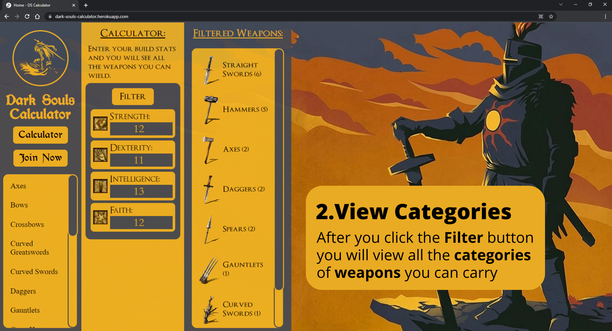
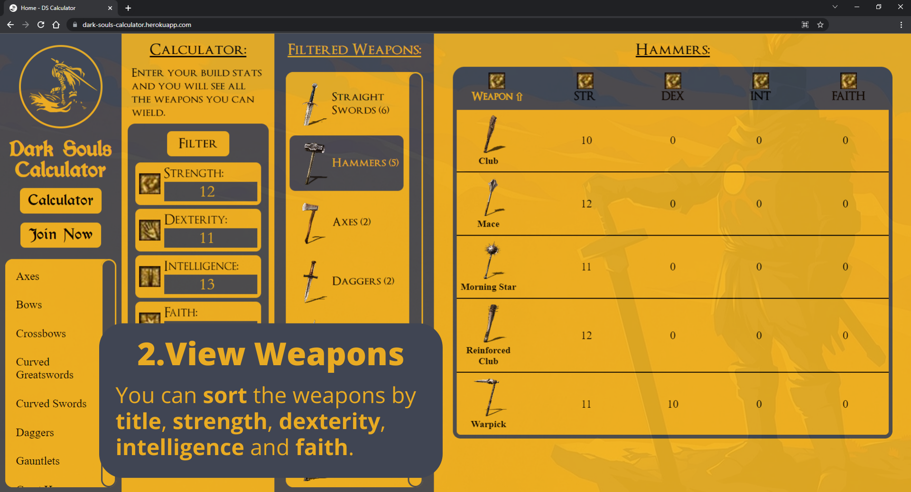
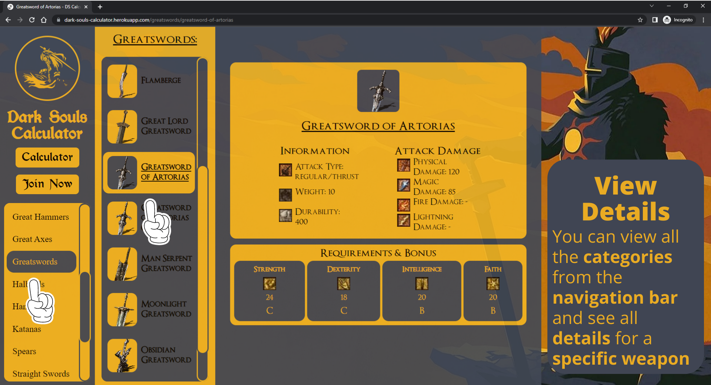
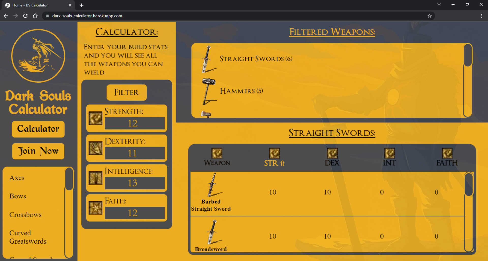
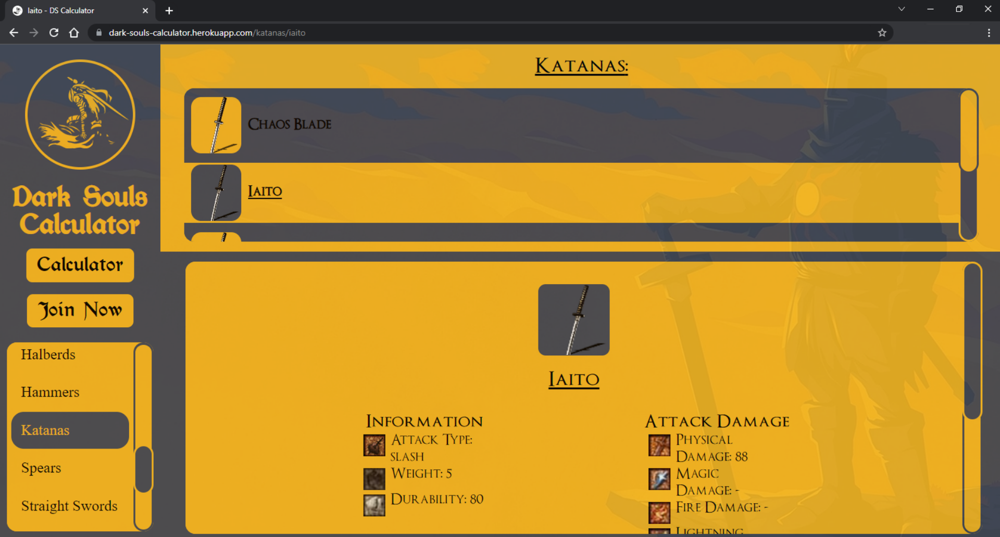

  
  <h3 align="center">Dark Souls Calculator</h3>

  

    Redux Toolkit Project
     
    <a href="http://dark-souls-calculator.herokuapp.com/"> Live Demo of Site</a>
  

#### 📕 Info

This project was made with **MERN stack** - **Mongoose**, **Express**, **React**, and **NodeJS** written on **Typescript**. The site is built as a testing ground for my next big projects.

#### Table Of Contents

📌 [0. About](#About)
📌 [1. Getting Started with Java](#1-Getting-Started-with-Java)

### About

The project is split into two folders - **server** and **client**.

- For the _server part_, we have an **Express API** running with a **Mongoose** database.
- For the _client part_, we have a simple react application, using **Redux**, **Redux-Toolkit**, and **Styled-Components**.

### 1. Project Overview

##### How Does The Calculator Work?

#### Responsive Design

